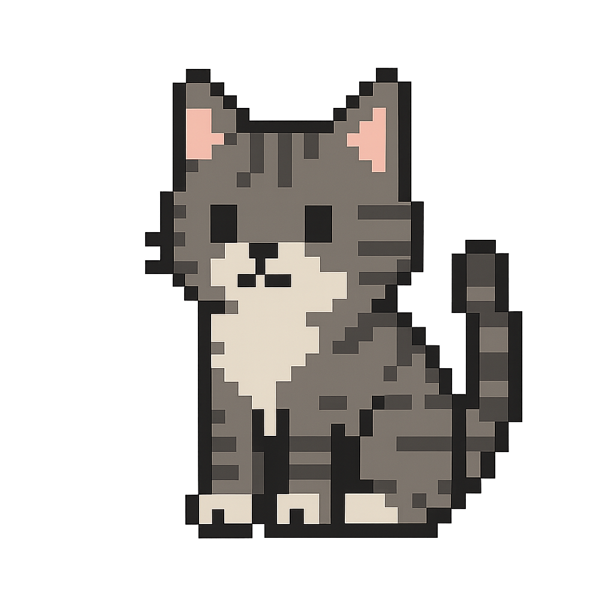

# 🕹️ To Do Quest

Pixel アートで **“タスク管理 × RPG”** を楽しむミニ Web アプリです。  
タスクをクリアして経験値を稼ぎ、レベルを上げながらネコと冒険(?) しましょう！

<p align="center">
  
</p>

---

## 📦 Tech Stack

| Layer      | Tech / Library | Why |
| ---------- | -------------- | --- |
| Frontend   | **React 18 + TypeScript** | コンポーネント思考で実装しやすい / 型安全 |
| Build      | **Vite**       | 超高速 HMR / 0-config で TS & JSX |
| Styling    | **Tailwind CSS** + **NES.css** | 8-bit 風 UI をユーティリティで素早く調整 |
| State Mgmt | React Hooks (`useReducer` / Context) | 規模が小さいため外部ライブラリ不要 |
| Auth / DB  | LocalStorage (MVP) → Firebase へ拡張可 | まずは依存ゼロで完結 |

---

## 🚀 Getting Started

```bash
# 1. クローン
git clone https://github.com/nashisandesu/ProgateWomensHackathon.git
cd ProgateWomensHackathon

# 2. 依存をインストール
npm install

# 3. 開発サーバー起動
npm run dev   # → http://localhost:5173
